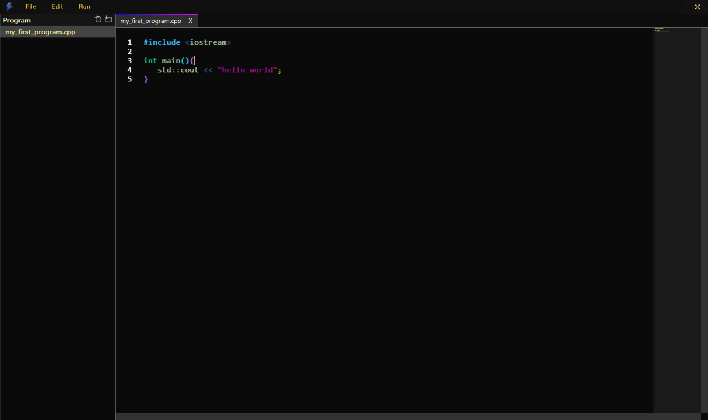
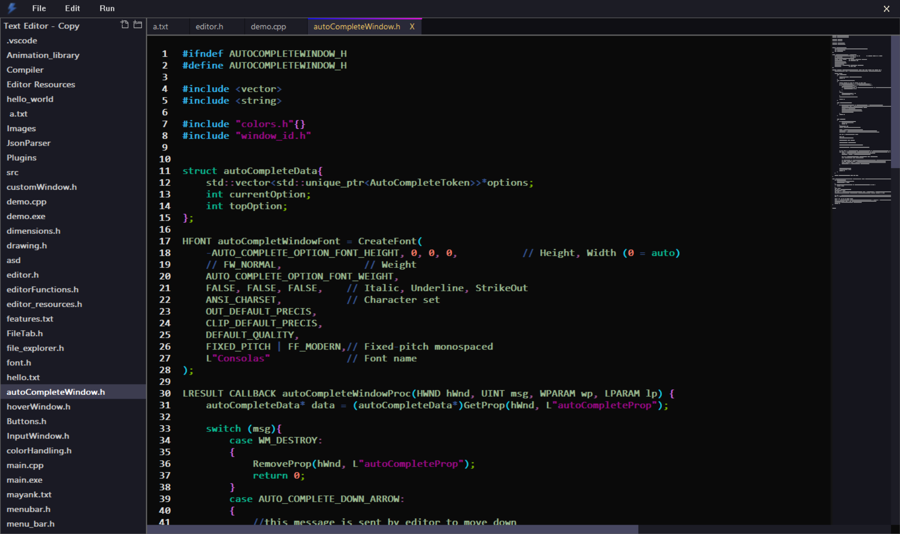
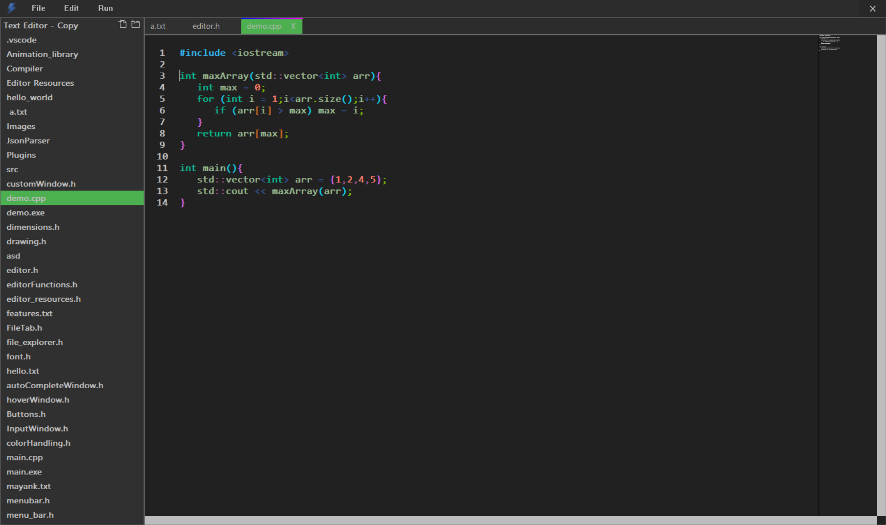

<div align="center">
  
  <br>
  
  <br>
  
  
  
</div>

---

## ⚡ Thunder Code Editor

Thunder Code Editor is a **lightweight, blazing-fast code editor** built entirely in **C++** using the **Win32 API** and **GDI+** for rendering.<br>
It’s designed for speed, extensibility, and customization — with support for themes, syntax highlighting, and an extension API.<br>
Currently **under development**, but already packed with features that make it stand out.

---

## 🚀 Features


- **Custom Win32 & GDI+ Rendering**  
  No heavy frameworks — the UI is handcrafted using raw Windows API calls and GDI+ for crisp text rendering.

- **Custom JSON Parser**  
  The editor includes its own **JSON parsing engine** for lightning-fast configuration and theme loading.

- **Custom Python Parser**  
  Efficient and accurate syntax highlighting for Python.

- **Syntax Highlighting**  
  Highlight code in multiple languages with customizable color schemes.

- **Multiple Themes**  
  JSON-based theme files let you style every aspect of the editor.

- **File Explorer**
  - Navigate project directories directly.
  - Smooth expand/collapse animations.

- **Cool Animations**
  - Smooth transitions on click.
  - Animated file explorer and editor actions.

- **Mini Code Viewer** for quick file peeks.

- **Extension API** for adding new languages, commands, and features.

- **Lightweight & Fast** — minimal memory, instant load.

---

## 🛠️ Technologies Used

<p align="center">
  
  
  
  
  
</p>

---

## 📸 Screenshots

<div align="center">
  
  <br>
  
  <br>
  
</div>

---

## 📦 Extension API

Thunder comes with an **Extension API** that allows developers to:
- Add **new language parsers**
- Modify **syntax highlighting rules**
- Add **custom commands**
- Create **theme packs**

Extensions are loaded dynamically and can interact with the editor’s core.

---

## 🎨 Themes

Themes are **JSON-based** and control:
- Background colors
- Syntax colors
- UI element styling

<details>
  <summary>Example theme customizing</summary>

  ```json
  {
    "mainWindow": "#0a0a0a",
    "titlebar": "#1a1a2e",
    "windowControlButtonsbk": "#0d1117",
    "windowControlButtonstc": "#44d9ff",
    "hoverButtonColor": "#00c3ff",
    "hoverWindowColorbk": "#11111b",
    "hoverWindowColortc": "#00eaff",
    "menucolorbk": "#0e0e12",
    "menucolortc": "#00c7ff",
    "menucolorhoverbk": "#1a1c2c",
    "menucolorhovertc": "#2fe3ff",
    "hoverwindowhighlightline": "#00ffff",
    "filetabContainer": "#12141c",
    "filetabbk": "#0f0f0f",
    "filetabtc": "#26c9ff",
    "filetabhoverbk": "#1a1f2e",
    "filetabhovertc": "#55f2ff",
    "scrollbarbk": "#131313",
    "scrollbarthumb": "#2fd5ff",
    "editorbk": "#0a0f15",
    "editortc": "#c0dfff",
    "editorSelectedLinebk": "#162030",
    "editorSelectedTextbk": "#2fb9ff",
    "autoCompleteOptionbk": "#10151d",
    "autoCompleteOptiontc": "#37ccff",
    "autoCompleteOptionHoverbk": "#0e1723",
    "autoCompleteOptionHovertc": "#60e7ff",
    "miniCodeViewerbk": "#0a0f18",
    "miniCodeViewertc": "#00b7ff",
    "fileExplorerBk": "#0d1015",
    "fileExplorerItemBk": "#0d1015",
    "fileExplorerItemTc": "#31cfff",
    "fileExplorerHoverItemBk": "#1a232e",
    "fileExplorerHoverItemTc": "#00f0ff",
    "fileExplorerItemSelectedBk": "#13202d",
    "fileExplorerItemSelectedTc": "#68efff",
    "inputWindowBk": "#10151c",
    "inputWindowTc": "#45dbff",
    "contextMenuBk": "#11151c",
    "contextMenuTc": "#44ceff",
    "contextMenuHighLightBk": "#1d2c3c",
    "contextMenuHighLightTc": "#8ff6ff"
  }
  ```
</details>


## 🚧 Development Status

Thunder Code Editor is **under active development**.<br>
Planned features:
- Multi-tab editing
- More language parsers
- Plugin marketplace
- Advanced debugging tools

---

## 📜 License

This project is licensed under the [MIT License](LICENSE).

---

## 💡 Contributing

Contributions are welcome!  
- Fork the repository.
- Create your feature branch (`git checkout -b feature/AmazingFeature`).
- Commit your changes (`git commit -m 'Add some AmazingFeature'`).
- Push to the branch (`git push origin feature/AmazingFeature`).
- Open a pull request.

---

## 📬 Contact

**Author:** Mayank Golchha  
<a href="https://github.com/Mayank-Golchha"></a>
<a href="https://www.linkedin.com/in/mayank-golchha-9b2730370/"></a>
<br>
**Repo:** [Thunder Code Editor](https://github.com/Mayank-Golchha/Thunder-Code-Editor)

---

<div align="center">
  
</div>

<div align="center">
  
</div>
